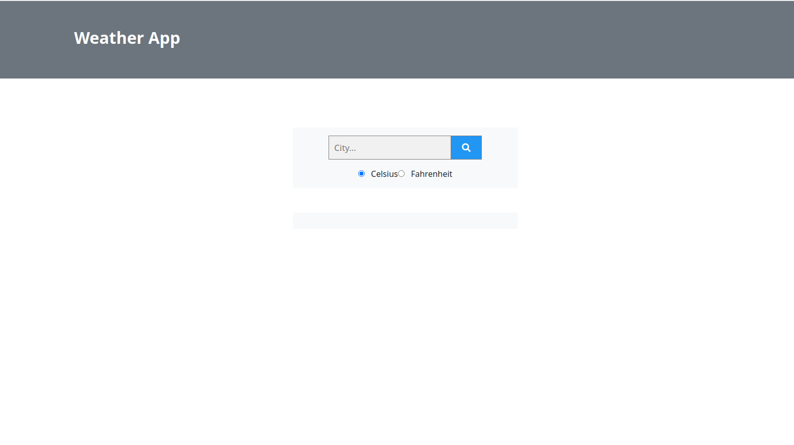

# weather-app
App to get weather details of cities

- This App relies on the Open weather API to collect weather report and information for various cities in the world

## Built With

- HTML
- CSS
- Bootstrap
- Javascript
- Webpack
- Open Weather API
- Giphy API

Live Demo: [Weather-App](https://inspiring-bose-84a6ab.netlify.app)

## Getting Started

To get a local copy up and running follow these simple example steps:

### Setup

- Clone the repo `git clone https://github.com/adedayoopeyemi/weathr-app.git`
- `cd` into the cloned repo `cd weather-app`
- Have fun

## Authors

👤 **Opeyemi Oyelesi**

- Github: [@Adedayoopeyemi](https://github.com/Adedayoopeyemi)
- Twitter: [@Oyelesiopy](https://twitter.com/oyelesiopy)
- Linkedin: [Opeyemi Oyelesi](https://linkedin.com/opeyemioyelesi)

## Contributing

Bug reports and pull requests are welcome on GitHub at https://github.com/adedayoopeyemi/weather-app.

## License

The gem is available as open source under the terms of the [MIT License](https://opensource.org/licenses/MIT).
